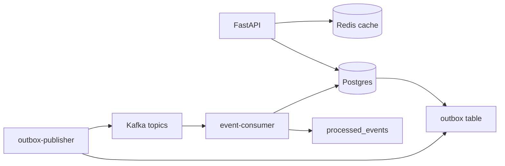

# Todo API

Task management HTTP API with JWT authentication, user-scoped CRUD, Redis cache-aside, and durable domain events via a transactional outbox and Kafka.

## Features

- Register / login with JWT (Argon2 password hashes)
- CRUD tasks scoped to the current user
- Dashboard: stats, recent tasks, Redis availability
- Task-list cache-aside in Redis (keys scoped by `user_id`, invalidated on write)
- Domain events: `user.registered`, `task.created`, `task.completed`
- Transactional outbox → Kafka publisher (row marked `published` only after produce ack)
- Idempotent Kafka consumer (`processed_events` inbox)
- Rate limiting, CORS, structured logging, global exception handlers
- Health endpoint for Docker / Compose

Search/analytics (e.g. Elasticsearch) is out of scope. Write-side effects go through the outbox. ARQ job enqueue is not on the request path; the lifespan Redis pool is used for dashboard ping.

## Architecture

```text
Client
  └─ FastAPI (main.py)
        ├─ routers (auth, tasks, dashboard, health, …)
        ├─ TodoService
        ├─ SQLAlchemy session per request → Postgres
        └─ Redis cache-aside (task list)

Same DB transaction as the write
  └─ outbox row (pending)

outbox-publisher worker
  └─ produce to Kafka → ack → status = published
       (broker error → stay pending; max attempts → failed)

event-consumer worker
  └─ inbox processed_events
       ├─ new event_id  → apply handler + insert inbox
       └─ duplicate     → skip (no handler, still ack offset)
```



## Stack

| Layer | Choice |
|-------|--------|
| HTTP | FastAPI + Uvicorn |
| Validation | Pydantic v2 |
| DB | SQLAlchemy 2 + Alembic; Postgres for the app, SQLite in pytest |
| Auth | JWT (`python-jose`) + Argon2 (`argon2-cffi`) |
| Cache | Redis |
| Messaging | Kafka (`aiokafka`) + outbox table |
| Process extras | ARQ Redis pool in app lifespan (health ping); Celery modules present but not the event path |
| Tests | pytest, TestClient, mocked SQLAlchemy query chains |
| Packaging | `uv` + `pyproject.toml` |
| Runtime | Docker Compose for API + Kafka + workers; Postgres on the host |

## Repository layout

```text
todo-api/
├── main.py                      # FastAPI app + lifespan
├── pyproject.toml
├── uv.lock
├── alembic.ini
├── Dockerfile
├── docker-compose.yml
├── .dockerignore
├── .env.example
├── .github/workflows/ci.yml
├── alembic/
│   ├── env.py
│   └── versions/
│       ├── e6f3a7813277_baseline_all_tables.py
│       ├── 38f5dcbc9371_add_processed_events_inbox.py
│       └── _archive/
├── workers/
│   ├── outbox_publisher.py
│   └── event_consumer.py
└── todo/
    ├── config.py
    ├── database.py
    ├── models.py
    ├── schemas.py
    ├── service.py
    ├── dependencies.py
    ├── exceptions.py
    ├── logging_config.py
    ├── rate_limiter.py
    ├── cache.py
    ├── redis_utils.py
    ├── jobs.py
    ├── auth_sevice.py
    ├── messaging/
    │   └── outbox.py
    ├── celery_app.py
    ├── celery_tasks.py
    ├── routers/
    │   ├── auth.py
    │   ├── tasks.py
    │   ├── dashboard.py
    │   ├── health.py
    │   ├── reports.py
    │   └── admin.py
    └── tests/
        ├── conftest.py
        ├── test_api.py
        ├── test_auth.py
        ├── test_service.py
        ├── test_outbox_publisher.py
        └── test_event_consumer.py
```

Do not commit: `.env`, `.venv/`, `.idea/`, `.pytest_cache/`, `.coverage`, `*.db`, `*.egg-info/`, `celerybeat-schedule`, `.DS_Store`, local notes and SQL client project files.

## Prerequisites

- Python 3.11+
- [uv](https://docs.astral.sh/uv/)
- Postgres on the host (`todo_db` / `todo_user`) — not defined in Compose
- Redis on the host (`localhost:6379`) or a Compose service named `redis`
- Docker Desktop for Compose (Kafka + API + workers)
- Alembic for the application schema (`create_all` is tests-only)

## Quick start

```bash
cp .env.example .env
# set SECRET_KEY and DATABASE_URL

uv venv
uv sync
uv run alembic upgrade head
uv run uvicorn main:app --reload --host 0.0.0.0 --port 8000
```

Open http://127.0.0.1:8000/docs

1. `POST /register` — username, email, password
2. `POST /login` — form username + password → `access_token`
3. Authorize in Swagger → `GET /tasks`, `POST /tasks`, dashboard

From the API container, Postgres is `host.docker.internal` (`extra_hosts: host-gateway`). Host workers use Kafka at `localhost:9092`; Compose services use `kafka:29092`.

## Environment

See `.env.example`. Groups:

- **Auth** — `SECRET_KEY`, `ALGORITHM`, `ACCESS_TOKEN_EXPIRE_MINUTES`
- **Database** — `DATABASE_URL`
- **Redis** — `REDIS_HOST`, `REDIS_PORT`, cache TTL
- **Kafka** — bootstrap, topics `todo.users` / `todo.tasks`, consumer group
- **Outbox** — batch size, poll interval, max publish attempts

Commit `.env.example` only.

## Tests

```bash
PYTHONPATH=. uv run pytest todo/tests -v --tb=short
```

Coverage:

```bash
PYTHONPATH=. uv run pytest todo/tests --cov=todo --cov-report=term-missing -v
```

Workers only:

```bash
PYTHONPATH=. uv run pytest todo/tests/test_outbox_publisher.py todo/tests/test_event_consumer.py -v --tb=short
```

- API tests use SQLite and override `get_db`. The rate limiter is disabled via an autouse fixture.
- Publisher tests inject the test session.
- Consumer tests patch `workers.event_consumer.SessionLocal` to `TestingSessionLocal` so inbox rows share the test database.
- `TestClient` / slowapi deprecation warnings come from dependencies.

## Docker / Compose

```bash
docker compose up --build
```

- `todo-api` — Uvicorn; host Postgres; Redis as `redis` or `host.docker.internal`
- `todo-kafka` — PLAINTEXT `kafka:29092` / `localhost:9092`
- `outbox-publisher` and `event-consumer` — wait on Kafka `service_healthy`

Healthcheck: `GET /health`. Image command: `uvicorn main:app`.

## Messaging

Domain writes persist outbox rows in the **same transaction** as the entity. Only the publisher produces to Kafka.

| Event | When | Topic |
|-------|------|--------|
| `user.registered` | user registration | `KAFKA_TOPIC_USERS` (`todo.users`) |
| `task.created` | task create | `KAFKA_TOPIC_TASKS` |
| `task.completed` | mark done | `KAFKA_TOPIC_TASKS` |

Publisher: Kafka value is the outbox payload JSON. Status becomes `published` after produce ack. Broker errors leave the row `pending`. After `OUTBOX_MAX_ATTEMPTS` the row is `failed`.

Consumer: payload carries `event_id` and `event_type`. `INSERT` into `processed_events`; unique violation means a duplicate and is not raised. Other errors roll back so the Kafka offset is not committed. `already_processed()` is the redelivery fast path.

Task-list cache uses `todo/cache.py`. Dashboard Redis availability uses `ping_redis()` on the lifespan pool.

## Changelog

| Milestone | Area | Delivered |
|-----------|------|-----------|
| 1 | CLI | Typer + Rich, `dataclass`, JSON file store, `uv` |
| 2 | Persistence I/O | Atomic save / context managers |
| 3 | Ports | `Protocol` repository vs ABC |
| 4 | Package + tests | Module layout, pytest, `MagicMock` |
| 5 | Async | `asyncio.run`, `gather` / TaskGroup |
| 6 | HTTP | FastAPI, Pydantic schemas |
| 7 | Packaging | `pyproject.toml`, Dockerfile |
| 8 | Auth + DB | SQLAlchemy session-per-request, JWT, Argon2 |
| 9 | Platform | Registration, CORS, rate limit, logging, exception handlers, API/service tests |
| 10 | Containers | Multi-stage image, healthcheck, Compose |
| 11 | CI | GitHub Actions |
| 16 | Concurrency | `ThreadPoolExecutor`, `run_in_executor` on blocking reports |
| 17 | Cache | Redis cache-aside, `user_id` keys, invalidate on CUD |
| 18 | Background jobs | ARQ worker settings, soft-fail Redis lifespan |
| 19 | Async composition | Sequential vs `asyncio.gather` |
| 20 | Events | Outbox, publisher, consumer, `aiokafka` |
| 21 | Workers in Compose | API + Kafka + publisher + consumer |
| 22 | Delivery guarantees | Publish-after-ack, `processed_events`, worker tests |

Milestones 12–15 are unused numbers from an earlier schedule.

## Design notes

- **Session per request** — `Depends(get_db)` / `get_todo_service`. Do not keep a long-lived session on a singleton service.
- **Thin routers** — HTTP in routers; rules in `TodoService`.
- **Outbox, not commit-then-produce** — producing after commit without an outbox drops events on crash.
- **Ack, then mark published** — the reverse order duplicates or loses work on process kill.
- **Idempotent consumer** — unique `event_id` in `processed_events` must make redelivery safe.
- **Explicit settings** — workers must not fall back to implicit localhost defaults for Kafka or the database.
- **Alembic owns app schema** — `Base.metadata.create_all` only in `conftest`.

## Planned work

- Inject `Session` into `handle_message` / `mark_processed` and drop the `SessionLocal` test patch.
- CI job that runs publisher + consumer against Kafka and Postgres.
- Use the cache client for dashboard Redis ping if ARQ is fully removed.

## License

Proprietary unless a license file is added to the repository.
